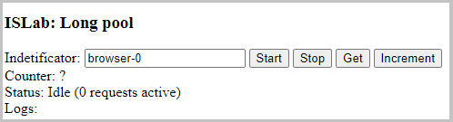

# ISLab Long Pooling

This application to experiment with long pooling technics from browser

Backend (spring boot + rest) maintains the state: a counter and provides api to manipulate it.

Frontend (Fremarker template + jquery) provides a simple page which access backend api.

### Background

Browsers had a limitation of a number of concurrent connection for the same domain.

For example Chrome allows 6 connections. However, I noticed that it has even smaller limits in some cases.

This app allows performing experiments to understand those cases better.

### Usage

Start the application and open in the browser: http://localhost:8080/

Here is a screenshot:

**Start/Stop** buttons - starts and stops long pooling. Counter, Status and Logs are updated on each request/response.

_Hint_: Open multiple tabs/windows/browsers to perform experiments.

**Get/Increment** buttons - you can get the counter once or execute increment

**Identificator** input - optional text used in the request. Useful to distinguish different tabs, windows and browsers.

### API

`/api/get` - returns counter value as a number

`/api/increment` - increments and returns counter value as a number

`/api/fetch/{browserId}/{old}` - main endpoint used for long pooling. If `{old}` value is different from counter response is returned immediately. If it is the same it is blocked (max 10 seconds) until value is updated or timeout occurs.
